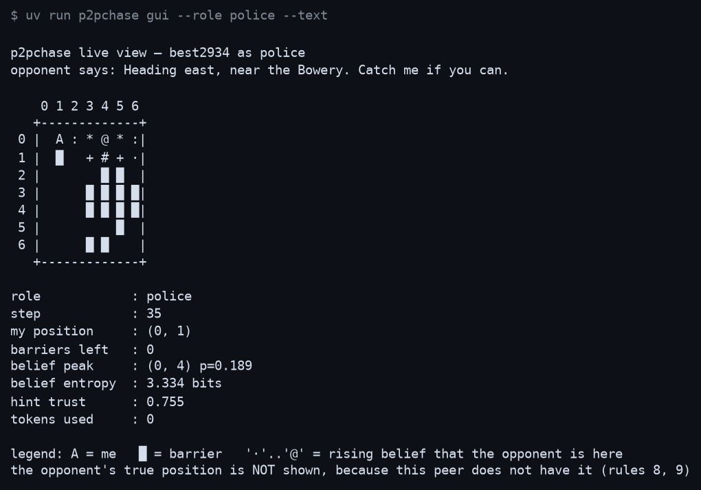
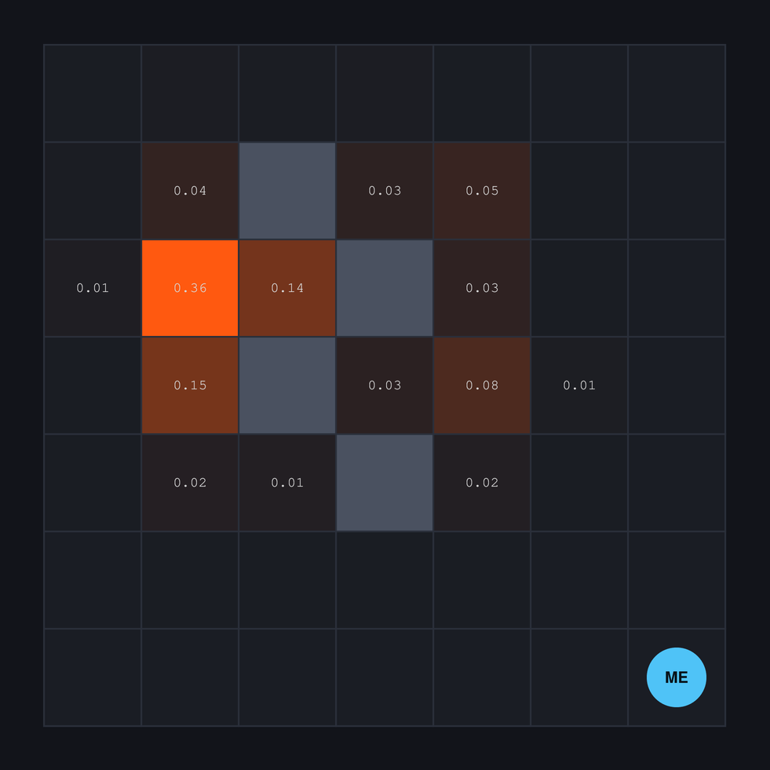
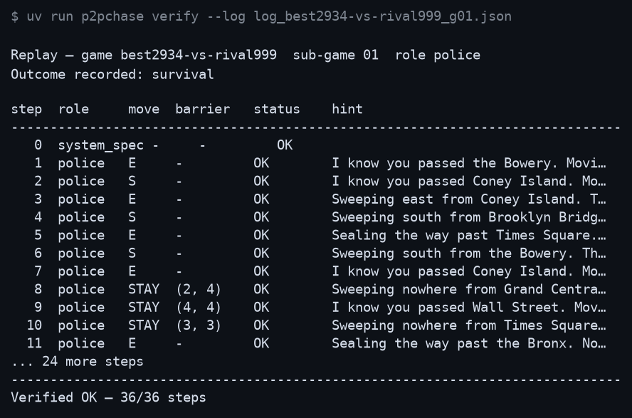
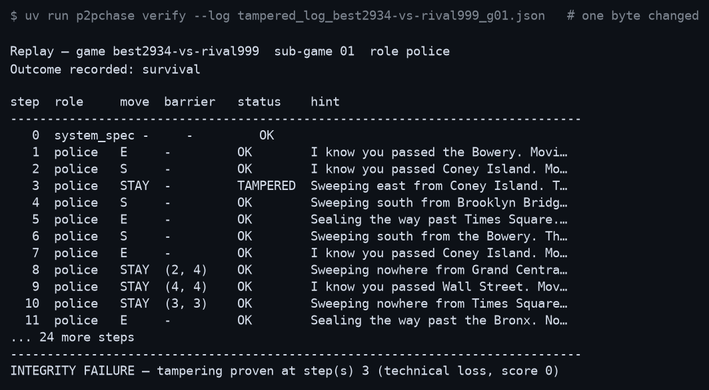

# best2934 — Cops and Robbers over a peer-to-peer network (thief)

**Final project · Orchestration of AI Agents (2026) · University of Haifa**
Group code **best2934** — Tomer Levy, Eyal Koloshi, Alon Issman

| | |
|---|---|
| Thief repository | https://github.com/Krayz1a/best2934-thief **(you are here)** |
| Cop repository | https://github.com/Krayz1a/best2934-cop |
| Booklet version implemented | 3.0.0 |
| Code version | 1.00 |
| Artifact schema version | 1.1 |

Two autonomous agents chase each other across a 7×7 grid. There is no server in
the middle, no referee, and no shared memory. Each agent runs an MCP server and
an MCP client at the same time, holds only its own truth, and has to infer the
rest — from an unforgeable scent trail, from barriers its opponent declares, and
from sentences its opponent may be lying in.

---

## Table of contents

1. [What this is](#1-what-this-is) · [Why it looks identical to the cop's](#11-why-this-repository-looks-identical-to-the-cops)
2. [Installation](#2-installation)
3. [Usage](#3-usage)
4. [Configuration guide](#4-configuration-guide)
5. [The model: a Dec-POMDP](#5-the-model-a-dec-pomdp)
6. [Orchestration over FastMCP, and its dilemmas](#6-orchestration-over-fastmcp-and-its-dilemmas)
7. [Strategies implemented](#7-strategies-implemented)
8. [Learning: what we did and did not use](#8-learning-what-we-did-and-did-not-use)
9. [Screenshots](#9-screenshots)
10. [Architecture](#10-architecture)
11. [Quality gates](#11-quality-gates)
12. [Contributing](#12-contributing)
13. [License and credits](#13-license-and-credits)

---

## 1. What this is

The cop wins by catching the thief. The thief wins by surviving 35 steps. The
cop can permanently seal cells, but only by giving up its move that turn, and
only 14 times per sub-game — so every wall is a trade.

What makes it a research problem rather than a chase is that **neither agent can
see the other**. The information one side gets about the other is:

| Channel | Trustworthy? | Why |
|---|---|---|
| Declared barrier | Yes, exactly | Declaring truthfully is mandatory (rules 15, 16) |
| Revealed move | Yes, but thin | "North" is a direction, not a position |
| Sampled scent | Yes, but noisy | Physics, not testimony — it cannot be forged |
| Verbal hint | **No** | The opponent may lie, and ours does |

Integrity is not taken on trust either. Every step is sealed with a SHA-256
commitment before it is disclosed, and every nonce is published at the end so
the whole chain can be replayed. A single altered bit is provable.

### 1.1 Why this repository looks identical to the cop's

Rule 41 asks for one repository per role. It does not ask for two codebases, and
two codebases would be two places for the same bug to live — a fix to the
commit-reveal chain or the belief update would have to be made twice and would
eventually be made once.

The engine is symmetric by construction: both brains are implemented here, both
sets of configuration ship, and either side can be selected at run time with
`--role`. This repository differs from
[`best2934-cop`](https://github.com/Krayz1a/best2934-cop) in a single line:

```python
# src/p2pchase/constants.py
DEFAULT_ROLE: Final[str] = ROLE_THIEF     # ROLE_COP in best2934-cop
```

plus this README and the tuning in `config/thief/setup.json`, which is where a
thief's judgement actually lives.
`tests/unit/test_shared/test_config.py::test_the_shipped_role_is_a_single_constant`
pins the constant to a real role and checks that an argument-free load selects
it, so the two repositories cannot silently drift into playing the same side.

Running the cop from this checkout is one flag:

```bash
uv run p2pchase play --role police --game-id best2934-vs-rival42
```

---

## 2. Installation

### Requirements

- **Python 3.11+**
- **[uv](https://docs.astral.sh/uv/)** — the only supported package manager
- **`python3-tk`** *(optional)* — for the graphical live view. Terminal mode
  works without it.
- **A tunnel** *(for league matches only)* — [ngrok](https://ngrok.com) or
  [Localtonet](https://localtonet.com). Rule 10 requires a publicly reachable
  MCP endpoint; localhost is legal for development only.

### Step by step

```bash
# 1. Install uv (once, per machine)
curl -LsSf https://astral.sh/uv/install.sh | sh

# 2. Clone and install
git clone https://github.com/Krayz1a/best2934-thief.git
cd best2934-thief
uv sync                      # core dependencies
uv sync --all-extras         # plus Gmail, Anthropic and notebook support

# 3. Optional: the graphical live view (Debian / Ubuntu)
sudo apt install python3-tk

# 4. Environment
cp .env-example .env         # then fill in your own values
```

> `pip`, `python -m venv` and `virtualenv` are not supported. Everything runs
> through `uv run` (guidelines §8.4).

### Environment variables

All secrets come from the environment; none are ever read from a config file or
written to a log (rule 39). `.env` is git-ignored.

| Variable | Needed for | Notes |
|---|---|---|
| `ANTHROPIC_API_KEY` | `trash_talk.provider = "claude_api"` | Optional — the default costs zero tokens |
| `P2PCHASE_GMAIL_SENDER` | Result reporting | Your agent's Gmail address |
| `P2PCHASE_GMAIL_CREDENTIALS` | Result reporting | Path to the OAuth client file |
| `P2PCHASE_GMAIL_TOKEN` | Result reporting | Path the consent flow writes |
| `P2PCHASE_SIGNING_SECRET` | Step-0 declaration | Any high-entropy string |
| `P2PCHASE_ROOT` | Wheel installs | Only when the checkout is elsewhere |

### Troubleshooting

| Symptom | Cause and fix |
|---|---|
| `FastMCP is not installed` | `uv sync` — the transport is a core dependency |
| `Tkinter is not installed` | `sudo apt install python3-tk`, or use `--text` |
| `missing private setup file` | You are pointing at the wrong `--config-dir` |
| `the agreed configuration violates Appendix F` | A permanent parameter was changed or a minimum lowered. Run `check-config` — it names every offending key |
| `no OAuth token at token.json` | Run `uv run p2pchase authorize-gmail` once, in a browser |
| `handshake REFUSED: config_sha256 mismatch` | You and your opponent hold different `game.json` files. They must be byte-identical (rule 11) |

---

## 3. Usage

### Verify the installation

```bash
uv run p2pchase check-config --role thief
uv run pytest
```

### Play a full local series (no opponent needed)

```bash
uv run p2pchase local-match --opponent rival42 --sub-games 6 --seed 7
```

Writes all four mandatory artifacts to `artifacts/`: one declaration, one config
and one log per sub-game, and one result report.

### Verify and audit logs

```bash
uv run p2pchase verify --log artifacts/log_best2934-vs-rival42_g01.json
uv run p2pchase audit  artifacts/log_*.json         # rule 36, mutual audit
```

Both exit non-zero on a verification failure, so they work as CI gates.

### Watch the belief map

```bash
uv run p2pchase gui --role thief            # Tkinter heat map
uv run p2pchase gui --role thief --text     # terminal, no Tkinter needed
```

### Rehearse first

Before any match, play one against yourself over real sockets:

```bash
uv run python tools/rehearsal.py
```

Two whole peers, two processes, two ports, one sub-game, and a pass only if both
finished, agreed on the ending and audited each other clean. This is the only
check that crosses a socket — the test suite reaches the handlers in-process,
which is the right shape for testing the protocol and structurally blind to the
transport. Every bug listed in [ADR-015 through ADR-018](docs/PLAN.md) was found
here and by nothing else.

### Play a real match against another team

One command. `play` **is** the peer: it serves our tools and calls theirs over
one session, because the turn loop has to see what arrives (see
[`runtime/peer_host.py`](src/p2pchase/runtime/peer_host.py)). The two processes
rules 1 and 2 require are the two *teams'*, one each.

```bash
uv run p2pchase play --role thief --game-id best2934-vs-rival42 \
                     --port 8801 \
                     --opponent-url https://their-tunnel.ngrok.io/mcp
```

It waits for the opponent's endpoint to answer before move one, so whoever
presses enter first simply waits rather than losing the match to a race.

For a league match, expose port 8801 through your tunnel and put the public URL
in `network.public_url`. `p2pchase serve` runs only the server half, which is
useful for letting an opponent check reachability early — but a match is played
with `play`.

**Keeping it up, and knowing that it is:**

```bash
uv run python tools/endpoint.py up       # start whatever is missing, detached
uv run python tools/endpoint.py status   # exit 0 only if a real handshake lands
```

"Our peer is up" is a claim about three things — the server is listening, the
tunnel agent is running, and a real MCP client can complete a handshake through
the public URL — and two of them fail silently. `status` proves the third the
same way an opponent discovers it, by shaking hands, because a listening socket
is not an endpoint. Both halves are started in their own session so that closing
the terminal does not take the match down with it; we lost nine hours to exactly
that, and rule 6 charges *both* teams for a sub-game that never starts.

**Both roles, one address, no changeover.** Rule 41 puts each role in its own
repository, so a league series needs two peers reachable. We used to point one
tunnel at whichever role the current half needed and move it at half time. That
is wrong, and an opponent told us why: a tunnel that follows the role is torn
down once per swap and drops the endpoint exactly where the next handshake
lands. Under the odd/even convention the role flips every sub-game, so it would
happen five times a series.

[`tools/frontdoor.py`](tools/frontdoor.py) removes the swap. Both peers run
permanently and one path-routing proxy fronts them:

```
https://<domain>/cop/mcp     -> 127.0.0.1:8801   best2934-cop
https://<domain>/thief/mcp   -> 127.0.0.1:8802   best2934-thief
https://<domain>/health      -> which roles are actually answering
```

Streaming is forwarded rather than buffered — MCP's transport is
streamable-HTTP, and a proxy that collects the whole response first turns every
server-sent event into a message that arrives after the turn it belonged to.

Every outbound call carries `ngrok-skip-browser-warning`. ngrok's free tier
answers a bare request with an HTML interstitial and status **200**, which is
worse than an error: a dead peer and a live one both read as "200, fine", and
the transport's own 406 can never be seen. It is served on User-Agent, so our
client was already getting through — but that is a property of a dependency's
default header rather than a decision we made.

### The role convention is per pairing, not per league

The rulebook never assigns roles across a series, so teams converged on two
different order-independent rules — cop for the **first half** (1,2,3), or cop
on the **odd** sub-games (1,3,5). Both give each team three of each role.

They disagree at sub-games **2 and 5** only. That is the dangerous part: they
agree on four of six, *including sub-game 1*, so a mismatched pairing plays
cleanly twice and then produces two cops. `roles.convention_divergence` computes
the set rather than trusting anyone's arithmetic — including ours, which was
wrong once and was corrected by an opponent reading our own published lists.

So the convention travels with the opponent in `setup.json`, exactly like the
scent model: `first_half` with gal-roy1, `odd_even` with imreeyal, from one
process. An unknown convention raises instead of falling back, because a silent
fallback is how two peers end up internally consistent and mutually unplayable.

### Report the result

```bash
uv run p2pchase authorize-gmail                       # once, in a browser
uv run p2pchase send-report --result artifacts/result_<game>.json          # dry run
uv run p2pchase send-report --result artifacts/result_<game>.json --live   # sends
```

The report goes to `rmisegal+uoh26finalgame@gmail.com` as an **attached JSON
file** — never as body text, which would be rejected and score zero (rule 34).
The recipient is forced at load time and cannot be redirected by editing a
config file.

**For a counted series you do not run any of that.** Rule 32 makes reporting the
agent's job, so `services/settlement_report.py` fires the report itself the
moment the signed number of sub-games is on disk — no human, no flag, no
terminal. The commands above remain for friendlies and for the manual fallback.

Four guards, because an automatic mailer is the most dangerous object here:
counted pairings only (the flag is read from the pairing, never passed by a
caller who could forget it); complete series only, checked against the *signed*
`num_sub_games`; exactly once, with a receipt on disk as the sentinel, written
even on failure so nothing silently retries into a rate limit; and it never
raises, because a mail failure must not take down the match that produced the
evidence.

That last guard earned itself on its first live firing: the send died on a
missing dependency, the match was unaffected, the receipt recorded
`sent: false`, and the report went by hand two minutes later. **If the receipt
says `sent: false`, send it by hand** — rule 35 voids the match for *both* teams
on a missing report.

### Typical workflow

```
check-config → rehearsal.py → agree game.json with the opponent → play
            → verify (own logs) → audit (their logs)
            → counted: the report fires itself at the sixth settle
            → friendly: send-report --live
```

---

## 4. Configuration guide

Four files, and the split is deliberate.

| File | Shared? | Purpose |
|---|---|---|
| `config/<role>/game.json` | **Yes, byte-identical** | The agreed physics. Locked with `config_sha256` (rule 11) |
| `config/<role>/setup.json` | No | Ports, URLs, strategy weights, provider choice, identity |
| `config/rate_limits.json` | No | Gatekeeper limits, versioned separately |
| `config/logging_config.json` | No | Logging |

The decision test is one question: *must the opponent agree to this value, or
rely on it?* If yes it is shared; if no it stays private. A private file can
never weaken a signed term — the shared file overlays it, not the reverse.

### Parameters that matter

| Key | Default | Class | Effect |
|---|---|---|---|
| `board_and_agents.grid_size` | 7 | minimum | Larger boards favour the thief |
| `movement_and_barriers.max_barriers` | 14 | minimum | The cop's whole budget for shaping the arena |
| `movement_and_barriers.survival_threshold` | 35 | minimum | How long the thief must last |
| `pheromones.pheromone_decay` | 0.10 | **permanent** | How fast evidence goes stale |
| `pheromones.pheromone_kernel` | `book_table` | negotiable | `book_table` or `gaussian` — see below |
| `world.hint_max_words` | 15 | negotiable | Enforced locally, never left to the model |
| `strategy.*` | see `setup.json` | private | Tuning weights; measured in `notebooks/` |

`PERMANENT` parameters may not change at all — deviation disqualifies the team,
so the loader refuses to start rather than silently play an illegal match.
`MINIMUM` parameters may be raised by mutual agreement, never lowered.

### The scent kernel, and why it is fingerprinted

The pheromone field is the only unforgeable evidence in the game, which makes it
worthless unless both peers compute it *identically*. The booklet gives the 5×5
emission table as a figure. We reproduce that table literally
(`pheromone_kernel = "book_table"`) and also derive it from a Gaussian with
σ² = 4/3, which matches the figure everywhere to within 0.01 — except the
diagonal, where the closed form gives 0.43 against the figure's 0.42.

That one cell is exactly the kind of silent disagreement that would corrupt a
match without either side noticing, so the kernel and decay rate are hashed into
a `scent_fingerprint` and compared during the handshake.

### Two scent models, locked per pairing

The book is not the only reading in the league. Its ch4 prose gives
*multiplicative* decay over the printed figure-4 kernel; the course's reference
implementation gives *subtractive* decay over a linear Chebyshev falloff. Both
are legal — Appendix F fixes the three numbers, not the shape of the update —
and they produce visibly different trails.

So both are implemented as **named registrations** in
[`domain/scent_models.py`](src/p2pchase/domain/scent_models.py), chosen per
opponent in `setup.json` rather than globally:

| | Physics | Played against |
|---|---|---|
| `multiplicative_book_v1` | `τ' = clamp((1−ρ)·τ + Δτ, 0, 0.9)`, figure-4 lookup, additive deposit | gal-roy1, and anyone who declares nothing |
| `subtractive_chebyshev_v1` | `τ' = round(max(0, τ − 0.1), 3)`, linear Chebyshev falloff, deposit merged by max | imreeyal |

A peer publishes a four-key document describing its choice, hashes it, and
declares **only the hash** as `scent_model_sha256`. The schema matters as much
as the hash: a bare digest over an ad-hoc dict means two teams implementing the
same model from the same page serialise different field sets and refuse each
other for no reason at all.

Ours reproduce the league's published digests — `81ebee59…` and `934c220d…` —
and the worked examples inside them are **derived from our own arithmetic rather
than transcribed**, which is what makes the digest a test of the physics instead
of a test of our typing.

**Refusal fires only when both peers declare and disagree.** Omission is never
refusal, in either direction. That rule now governs `scent_fingerprint` too,
which is our own construction and unknown outside our pairing with gal-roy1 —
comparing it strictly meant refusing, at the handshake, every team who had
simply never heard of it.

### The tied-series scoring choice

The book and the reference implementation contradict each other on what a level
series scores, and the course grants academic freedom to implement either
**provided the choice is documented and justified**. This is that justification.

**There are three behaviours, not two, and the third is the reference's.** We
originally proposed this as a two-valued choice; imreeyal went to the
reference's own published example and found that our description of it — and
the league kit's — was wrong. The kit's correction is in its WARNINGS §6a.

| `tie_rule` | Who runs it | A level 25–25 series scores |
|---|---|---|
| `series_add` | **us**, imreeyal, anrbj666, the league kit | **27 / 27** — tie score added to the sums |
| `series_replace` | the book's other reading | **2 / 2** — tie score *replaces* the sums |
| `per_subgame` | the unmodified reference implementation | **25 / 25** — no series-level step at all; a drawn *row* pays 2 apiece |

`per_subgame` is the dangerous one, and we carry it without running it. It
agrees with `series_add` whenever some sub-game drew, and differs only when a
series ties with **no drawn row** — and the reference's own sparring peer cannot
produce a drawn row at all, since capture pays 20/5 and survival 5/10, never
equal. So an unmodified reference opponent and this codebase would settle a
level series differently having never once disagreed in rehearsal, and rule 35
would void it for both of us.

That is why the rule is a **declared** pairing term (`tie_rule` in
`setup.json`), not a conformance question. Two teams can each be correct and
still disagree; the only unsafe option is leaving it unsaid until a series
happens to tie.

**We run `series_add`.** `SeriesTally.finalise` and `reports/agreed.series_totals` both apply
`tie_score` on top of the accumulated points, and `raw_score` / `scores` keep the
untouched sums beside the adjusted total so the adjustment is always visible
rather than baked in.

We changed to this from the replacing reading, and not because the book argument
is weak. Three reasons, in the order that decided it:

1. **Rule 35 charges both teams.** Contradictory reports void the match and
   score *both* sides zero. A reading we hold alone is not a private act of
   principle — it costs the opponent their points too. Being solo-correct is
   worse for the league than being conventionally wrong.
2. **Every other implementation we can check sums.** The reference does; so does
   the `copthief-league-protocol` kit, whose published fixtures we verified
   against our own encoder before adopting.
3. **Replacing inverts the ordering.** Under it a hard-fought 25–25 series pays
   2, while a single sub-game win pays 20 — so a team would rank *higher* for
   one narrow victory than for six drawn ones. That is difficult to defend as
   the intent of a rule whose stated purpose is that no encounter goes unscored.

The cost is recorded rather than hidden: our settlement digest for a tied series
no longer matches the value gal-roy1 and we originally agreed
(`f57c1b85…` → `bc737517…`). Every non-tied vector still reproduces exactly, so
the divergence is confined to a level series — but a bilateral agreement changed
unilaterally is worth nothing, and it is theirs to recompute or object to before
any counted series. Both digests are pinned in
`tests/unit/test_reports/test_agreed.py` so neither can quietly disappear.

---

## 5. The model: a Dec-POMDP

The game is a decentralised partially observable Markov decision process,
⟨I, S, {Aᵢ}, T, R, {Ωᵢ}, O, h⟩:

- **I** — two agents, cop and thief.
- **S** — the joint state: both positions, the barrier set, both scent fields,
  and the step counter. **No agent ever observes s ∈ S.**
- **Aᵢ** — `{N, S, E, W, STAY}` for both, plus barrier placement for the cop,
  purchasable only by choosing `STAY`.
- **T** — deterministic given joint actions; barriers make it non-stationary,
  since the reachable set shrinks as the match proceeds.
- **Ωᵢ** — what an agent actually receives: its own position, the declared
  barriers, sampled scent intensities, a revealed direction, and a ≤15-word
  sentence of unknown veracity.
- **O** — the observation function, and the interesting part. Scent is a noisy
  but honest function of the opponent's recent trajectory; the hint is a
  channel the opponent controls and may corrupt at will.
- **R** — cop 20 / thief 5 on capture; cop 5 / thief 10 on survival; **0 to
  both** on a technical loss.

That last term is what makes the protocol part of the strategy. A technical loss
zeroes *both* sides, so there is no reward for stalling an opponent into a
timeout — and every deadline in this codebase exists because waiting politely
loses the game just as thoroughly as playing badly.

### The belief update

Each agent maintains a posterior `b(cell)` over where the opponent is
(`domain/belief.py`), updated in three stages per turn:

1. **Predict.** Diffuse over legal moves, plus a `STAY_PRIOR = 0.2` mass on
   standing still. Entropy rises.
2. **Scent.** Reweight by `exp(SCENT_SHARPNESS · τ(cell))` with
   `SCENT_SHARPNESS = 6.0`. Evidence, so entropy falls.
3. **Hint.** Reweight by `1 ± trust`, where `trust` is *learned* — see below.

### Cross-examining a liar

A hint cannot simply be believed or ignored. `score_hint` compares the claim
against the scent field: if the cells the claim implies carry a consistency
score ≥ 0.25 of the available trail mass, the claim is judged credible. Trust
then moves toward that verdict at `TRUST_LEARNING_RATE = 0.25`, bounded to
`[0.02, 0.90]`.

The bounds are the design. Trust never reaches 1.0, because an opponent that has
told the truth forty times running may be setting up the forty-first. It never
reaches 0.0 either, because a channel you have stopped listening to cannot be
used against its owner — and a liar who knows you have stopped listening is free.

---

## 6. Orchestration over FastMCP, and its dilemmas

Each agent is simultaneously an MCP **server** (exposing eleven tools) and an
MCP **client** (calling its opponent's). Symmetry is not aesthetic: an
asymmetric protocol would need one side trusted with sequencing, and there is
nobody to trust.

```
   Agent A                                     Agent B
┌──────────────┐                          ┌──────────────┐
│  MCP server  │◄──────── commit ─────────│  MCP client  │
│  (11 tools)  │───────── commit ────────►│              │
│              │◄──────── reveal ─────────│  MCP server  │
│  MCP client  │───────── reveal ────────►│  (11 tools)  │
└──────────────┘        sample scent      └──────────────┘
```

### Dilemma 1 — when to disclose the nonce

Revealing each nonce as its step is revealed would let each peer verify moves
immediately, which sounds strictly better. It is not: it also lets a dishonest
peer *wait* to see a verified move before committing its own. So nonces are
withheld until the sub-game ends and disclosed all at once (rule 18). We trade
per-step verification for the guarantee that neither side can ever act on
information the other has already proven.

### Dilemma 2 — refusal versus exception

A tool that raises reaches the opponent as an opaque transport failure, which
they cannot distinguish from our process crashing. Every handler therefore
returns `{"ok": false, "reason": ...}` instead. Since rule 6 charges *both*
teams for an unfinished sub-game, making our refusals diagnosable is in our own
interest, not a courtesy.

### Dilemma 3 — waiting versus aborting

Two clocks run. `TurnDeadline` (30s) bounds one message. `Watchdog` (60s)
measures *progress*, and is fed only when a step actually completes — because an
opponent that answers instantly with refusals never trips a per-message timeout
while the match goes nowhere. When either fires, we abort, tell the opponent
why, and take the technical loss rather than hang.

### Dilemma 4 — pull-based scent

Scent could be broadcast each turn. Instead a peer must *ask* about specific
cells (`sample_scent`). This keeps the trail evidence rather than a feed: you
learn only about cells you thought to ask about, and asking well is part of
playing well. It also bounds message size on a 7×7 board that a larger agreed
grid would otherwise blow up.

### Dilemma 5 — the model never moves

Rule 25 forbids the LLM from choosing moves, and it is the right rule. Move
selection is deterministic Python, fully inspectable and replayable. The model
touches only the taunt. A hallucinated illegal move is a technical loss, and no
amount of rhetorical quality is worth that risk.

---

## 7. Strategies implemented

### The cop — `domain/cop_brain.py`

Movement is greedy descent on **belief-weighted** distance, averaged over the
top six hypotheses rather than chasing the single peak — a flat posterior makes
peak-chasing oscillate. Ties break toward keeping our own escape routes open,
since the player building walls is also the player who can be trapped by them.

Barrier policy is where the thinking is. Greedy walling is actively bad: a
barrier can cut the cop off from the thief or hand the thief a fresh corridor.
A placement is accepted only when it

1. measurably shrinks the thief's reachable area (`barrier_min_gain`),
2. does not increase our own distance to the thief, and
3. is worth spending a unit of a finite resource *now* — barriers are held back
   until the thief is within `barrier_engage_range`, and
   `barrier_endgame_reserve` are kept for the final squeeze.

### The thief — `domain/thief_brain.py`

Maximising distance from the cop is a trap: it walks straight into corners,
which is exactly what barriers exploit. The dominant term is **reachable area**;
distance is a safety margin, not the goal. Inside `endgame_window` steps of
survival the objective flips to pure immediate safety.

**Deception is rationed.** The opponent runs the same scent-versus-claim
cross-check we do, so a thief that lies every turn simply trains the cop to
ignore it — and a hint nobody believes is worth nothing when you finally need
one. We lie only when the cop is within `bluff_range`, and only every
`bluff_period` turns. Credibility is a resource with a budget, like barriers.

### Extending

Both are extension points. Subclass `BrainBase`, override `_pick_move` (and
`_decide_move` for the cop), and point `strategy.brain` at
`your.module:YourClass`. The engine loads it by name; nothing else changes.

---

## 8. Learning: what we did and did not use

**We did not use reinforcement learning, and there are no learning curves.**
Saying so plainly is more useful than a plot of something we did not do.

Reasons: a match is 35 steps with 6 sub-games per opponent and a maximum of 10
opponents, so the on-policy sample budget is a few thousand transitions against
strategies we cannot observe in advance. Self-play would optimise against our own
thief and nobody else's. The heuristics above encode structure — reachable area,
resource budgeting, credibility management — that a policy learned from this
much data would not recover.

What we *do* learn online is the **trust weight** (§5), which is a genuine
adaptive estimator with a decision-theoretic justification rather than a fitted
policy, and the parameter sweep in `notebooks/` measures the strategy weights
empirically rather than by assertion.

---

## 9. Screenshots

### Live belief map

The agent's own view during a match — its cell, the declared barriers, and a
heat map of where it believes the opponent is. **The opponent's true position is
absent, because this process does not have it** (rules 8, 9).

The terminal renderer, which is what a headless machine gets. Note the last
line: the legend says out loud what the picture cannot show.



The Tkinter canvas renders the same data as a colour heat map:



> Tkinter ships as the `python3-tk` **system** package rather than through uv,
> so `tools/make_screenshots.py` cannot generate that last image on a machine
> without it — and it will not fake one. To produce it:
> `sudo apt install python3-tk`, then `uv run p2pchase gui --role thief` and
> capture the window.

### Replay verification

Every commitment recomputed against its disclosed nonce:



And the same log with one byte altered — tampering is provable, not suspected:



---

## 10. Architecture

```
External consumers (CLI / GUI / tests)
              │
              ▼
        ┌───────────┐
        │    SDK    │   single entry point for ALL business logic
        └─────┬─────┘
              ▼
   ┌──────────────────────┐
   │  services/           │  match · verification · negotiation · reporting
   └──────────┬───────────┘
              ▼
   ┌──────────────────────┐   ┌──────────────────────┐
   │  domain/             │   │  runtime/            │
   │  board · smell       │   │  peer · peer_session │
   │  belief · crypto     │   │  local_match         │
   │  brains · scoring    │   │  watchdog            │
   └──────────┬───────────┘   └──────────┬───────────┘
              ▼                          ▼
   ┌──────────────────────┐   ┌──────────────────────┐
   │  infra/              │   │  mcp/                │
   │  gatekeeper · gmail  │   │  handlers · server   │
   │  sysinfo             │   │  client · contracts  │
   └──────────────────────┘   └──────────────────────┘
```

No consumer reaches past the SDK. Business logic in a presentation layer cannot
be tested without that layer and cannot be reused by the next one.

Full C4 diagrams, UML and the eighteen architecture decision records are in
[`docs/PLAN.md`](docs/PLAN.md).

| Document | Covers |
|---|---|
| [`docs/PRD.md`](docs/PRD.md) | Goals, KPIs, acceptance criteria, functional and non-functional requirements |
| [`docs/PLAN.md`](docs/PLAN.md) | C4 levels 1–4, UML, ADRs, API and data contracts |
| [`docs/TODO.md`](docs/TODO.md) | Phases, owners, status, definitions of done |
| [`docs/PRD_belief_map.md`](docs/PRD_belief_map.md) | Bayesian posterior and the adaptive trust estimator |
| [`docs/PRD_stigmergy.md`](docs/PRD_stigmergy.md) | Pheromone kernel, decay, and reading a heading from a trail |
| [`docs/PRD_commit_reveal.md`](docs/PRD_commit_reveal.md) | SHA-256 integrity and the mutual audit |
| [`docs/PRD_deception.md`](docs/PRD_deception.md) | Lying, decoding, and lie detection |
| [`docs/PRD_gatekeeper.md`](docs/PRD_gatekeeper.md) | Rate limiting, quota, queueing, retries |
| [`docs/PRD_p2p_protocol.md`](docs/PRD_p2p_protocol.md) | MCP tools, state machine, the two clocks |
| [`docs/COMPLIANCE.md`](docs/COMPLIANCE.md) | All 55 mandatory rules mapped to code and test — including the four that are genuinely not done |
| [`docs/SUBMISSION.md`](docs/SUBMISSION.md) | The Moodle form, answered as far as the repository can answer it |
| [`docs/PROMPTS.md`](docs/PROMPTS.md) | Prompt book — how this was built with AI, including what went wrong |
| [`docs/GMAIL_SETUP.md`](docs/GMAIL_SETUP.md) | One-time OAuth setup, performed by a human |

---

## 11. Quality gates

```bash
uv run pytest                                   # tests, coverage ≥ 85%
uv run ruff check .                             # zero violations
uv run python tools/check_file_size.py src tests   # every file ≤ 150 code lines
uv run python tools/rehearsal.py                # one real sub-game over sockets
```

| Gate | Threshold | Enforced by |
|---|---|---|
| Test coverage | ≥ 85% | `fail_under` in `pyproject.toml` |
| Lint | 0 violations | `ruff check` |
| File size | ≤ 150 code lines | `tools/check_file_size.py` |
| End-to-end match | both peers finish, agree and audit clean | `tools/rehearsal.py` |
| Secrets in tree | 0 | `.gitignore` + `.env-example` |
| Package manager | `uv` only | `uv.lock` committed |

The last one is not a formality. The first four gates were all green while the
transport was refusing our own messages, the cop could not see a boxed-in thief,
and the two teams' agreement digests could never match — three separate ways to
score zero, none of them visible from inside a single process.

---

## 12. Contributing

- Every file stays under 150 code lines. When one grows past it, **split it by
  responsibility** — never compress it to fit.
- Docstrings on every module, class and public function, explaining *why*
  rather than restating *what*.
- Tests alongside the code, covering the error path as well as the happy one.
- No configurable value hard-coded: it belongs in `config/`, with the constant
  in `constants.py` as the fallback default.
- No business logic in `cli/` or `ui/`. Those layers call the SDK.
- Conventional, descriptive commits. Every counted match records the commit that
  played it (rule 53), so history has to stay legible.

---

## 13. License and credits

Released under the [MIT License](LICENSE).

The rules, the binding parameter table and the four artifact schemas are defined
by the project booklet v3.0.0 by **Dr. Yoram Segal**, University of Haifa. The
booklet is his copyrighted work and is not distributed here. The reference
simulator at [rmisegal/Game-P2P-Cop-Chase](https://github.com/rmisegal/Game-P2P-Cop-Chase)
was read for its artifact schemas; no code was copied, and where the booklet and
that code disagree, the booklet governs.

Third-party library attributions are listed in [`LICENSE`](LICENSE).

**Companion repository:** the cop agent lives at
[Krayz1a/best2934-cop](https://github.com/Krayz1a/best2934-cop) and shares this
engine — see §1.1.
