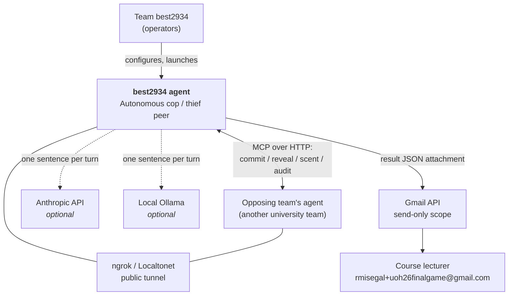
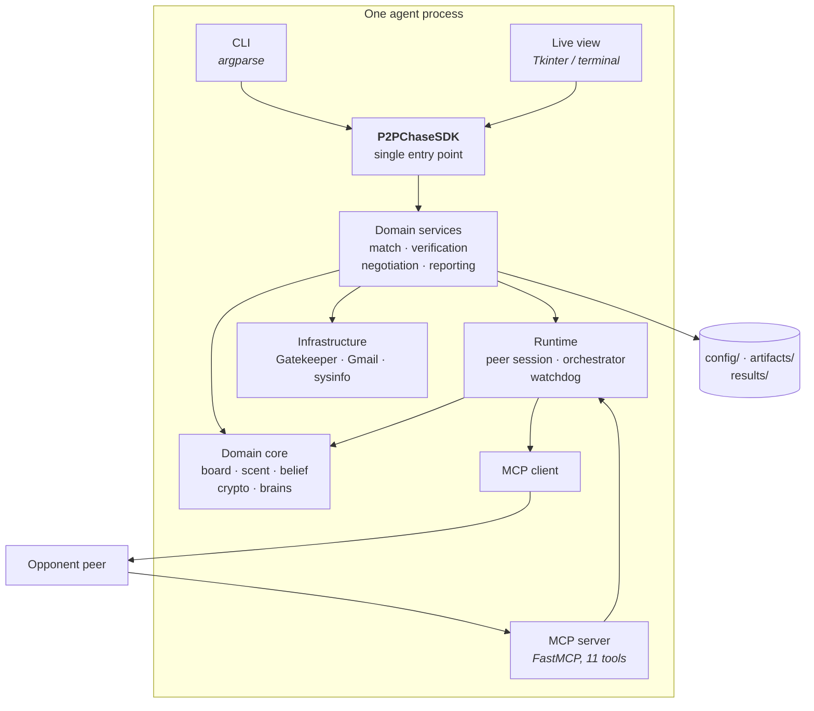
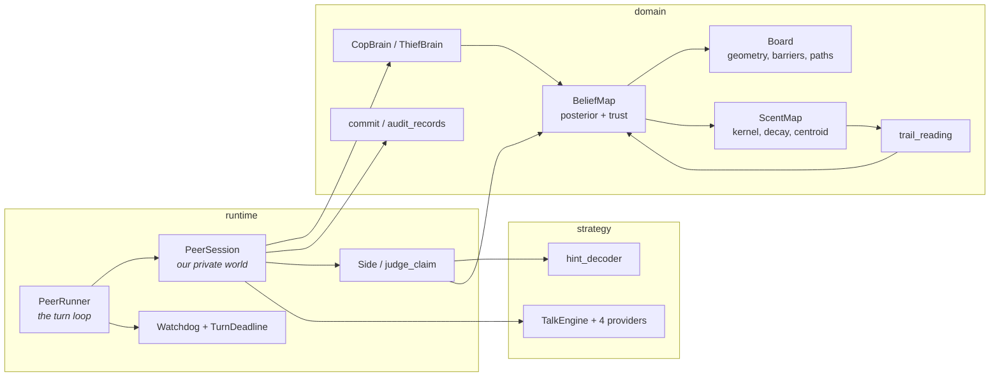
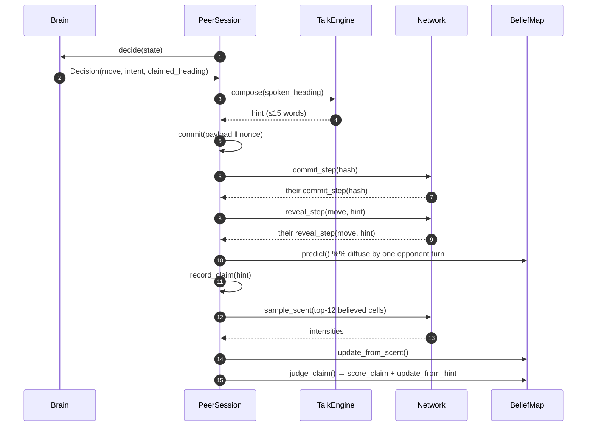
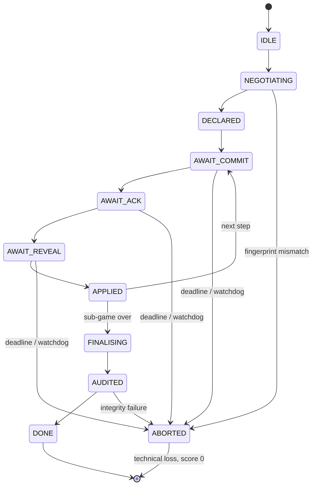
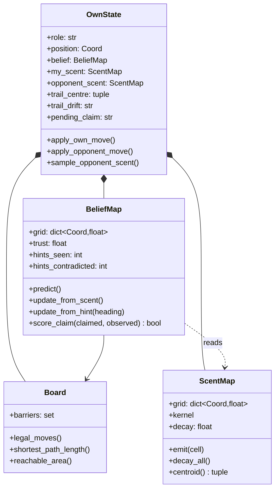
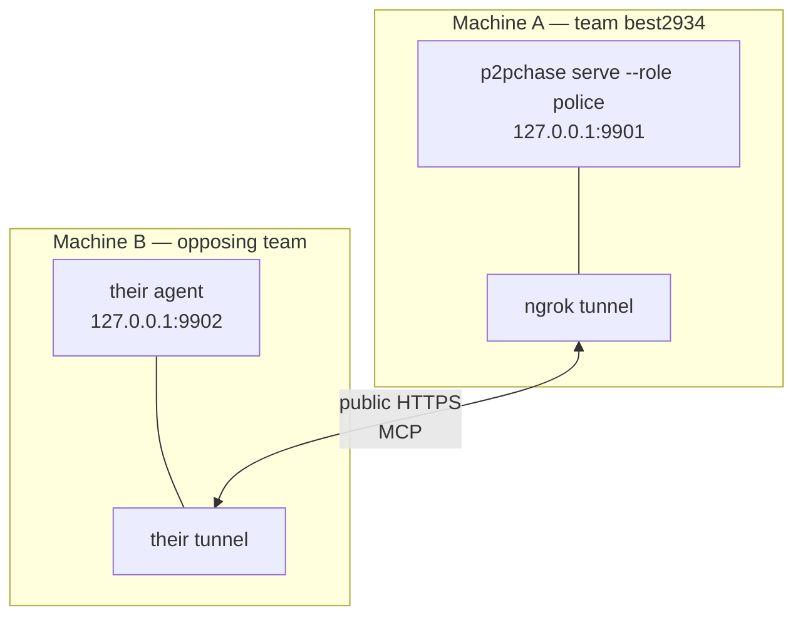

# PLAN — Architecture and Technical Design

**Project** `best2934-thief` (same engine as `best2934-cop`) · **Document version** 1.00 · **Code version** 1.0.0

Companion to [PRD.md](PRD.md). This document covers the C4 model, UML for the
non-obvious flows, the architectural decisions and their alternatives, and the
interface and data contracts.

---

## 1. C4 model

### 1.1 Level 1 — System context



There is deliberately **no** node in the middle. The tunnel forwards packets; it
arbitrates nothing.

### 1.2 Level 2 — Containers



**The layering rule.** Nothing above the SDK contains logic, and nothing below it
knows a presentation layer exists. A CLI command that decided anything could not
be reused by the GUI and could not be tested without argparse.

### 1.3 Level 3 — Components (runtime and domain)



### 1.4 Level 4 — Code: one turn, one peer



Step 12 is the one worth pausing on: the claim is *recorded* when the hint
arrives but *judged* only after the trail has been sampled, because the trail is
the only thing a claim can be checked against and it does not exist yet at
step 8.

---

## 2. UML

### 2.1 Turn state machine (rules 4, 5)



Any transition not drawn is rejected. A permissive protocol is how distributed
systems deadlock.

### 2.2 Class model — belief and evidence



Note what is **not** on `OwnState`: there is no `opponent_position`. The
epistemic constraint is enforced by the absence of the attribute, not by
discipline.

### 2.3 Deployment



Rule 1 requires two separate processes and rule 2 forbids shared memory between
them; the server binds a real socket even when both peers sit on one laptop. The
in-process `LoopbackClient` exists only for tests.

---

## 3. Architecture Decision Records

### ADR-001 · Peer-to-peer MCP, not client/server

**Status** Accepted.
**Context** Two agents must exchange moves without a referee.
**Decision** Each agent runs a FastMCP server *and* a client. The protocol is
symmetric: no initiator, no responder.
**Alternatives** (a) One agent hosts and the other connects — rejected, the host
sequences the game and is therefore a de-facto referee. (b) A shared message
broker — rejected, it is a central component by another name.
**Trade-off** Twice the moving parts per process, and the symmetric loop needs
care to avoid deadlock. Both peers push and wait concurrently, which is exercised
directly in `tests/integration/test_networked_sub_game.py` via `asyncio.gather`.

### ADR-002 · SHA-256 commit-reveal with nonces withheld until the end

**Status** Accepted.
**Context** With no referee, a peer could choose its move after seeing the
opponent's.
**Decision** Seal `SHA-256(canonical_json(payload) ‖ nonce)` before acting;
disclose payload at reveal and nonce only at the end of the sub-game (rule 18).
**Alternatives** (a) Reveal the nonce each step — rejected, it leaks the
commitment structure earlier than needed for no gain. (b) Digital signatures —
rejected, they authenticate the *author*, not the *timing*, which is the
property at issue here.
**Trade-off** Verification is deferred to the end. Accepted: the whole log is
checked at once, and a mismatch is a technical loss either way.

### ADR-003 · The LLM never decides a move

**Status** Accepted (rule 25).
**Context** A language model could plausibly pick moves.
**Decision** Movement is deterministic Python. The LLM composes only the
one-sentence hint.
**Alternatives** LLM-chosen moves — rejected: hallucinated illegal moves are a
technical loss, latency threatens the 30 s deadline, and a replayed log stops
being explicable.
**Trade-off** The rhetorical layer is decorative unless the *receiving* side
decodes it — which is why ADR-007 exists.

### ADR-004 · Belief transport, not re-weighting, for a directional claim

**Status** Accepted (supersedes the original design).
**Context** A hint claims a heading. The first implementation built the set of
cells "consistent with north" and boosted them.
**Decision** Transport a fraction `trust` of every cell's mass one step in the
claimed direction; leave `1 − trust` in place.
**Rationale** Once belief has diffused, almost every cell has a northern
neighbour, so the claimed set covered the board and the re-weighting cancelled
out — a mechanism that provably did nothing. A directional claim is evidence
about how the cloud *moved*, and transport is the update it licenses.
**Trade-off** Mass at a wall cannot move and stays put, which slightly biases
belief toward edges. Accepted: the alternative is belief evaporating off-board.

### ADR-005 · Cross-examine the sentence, not the revealed move

**Status** Accepted (bug fix, commit `96229b2`).
**Context** Lie detection scored the opponent's revealed move.
**Decision** Decode and score the *hint*.
**Rationale** The move is sealed in the commitment and is therefore always
truthful; cross-examining it could only ever confirm honesty. Measured: trust sat
pinned at its 0.9 ceiling in every match and a compulsive liar was
indistinguishable from an honest opponent.
**Result** Liar collapses to the 0.020 floor with 97% of its claims contradicted;
honest opponent settles at 0.724. Measured over 30 seeds — `results/trust.json`.

### ADR-006 · Read the opponent's heading from scent-centroid drift

**Status** Accepted.
**Context** A claim needs something physical to be checked against.
**Decision** Compare the sub-cell centroid of the opponent's trail between
samples; the dominant axis of the drift is the observed heading.
**Alternatives measured, not assumed** — (a) Half-plane scent mass relative to
the trail peak: agreed with the true heading on roughly half of turns, and was
outvoted by the wrong direction on several. (b) Peak-cell displacement: the peak
moves in integer jumps, so it reads as "no movement" then "impossible movement".
(c) Centroid drift: agreed on ~80% of turns where the opponent actually moved
(69.3% of all claims once stationary turns are counted too).
**Trade-off** Measured over 30 seeds, a perfectly honest opponent still has
30.7% of its claims contradicted, so trust settles at 0.724 rather than at the
0.90 ceiling. That is honest about the measurement's noise, and the separation
from a liar (0.020, with 97% of claims contradicted) is still decisive.

### ADR-007 · Deception is rationed, not sprayed

**Status** Accepted.
**Context** How often should the thief lie?
**Decision** Lie only when the believed cop position is within `bluff_range`, and
then only every `bluff_period` turns.
**Rationale** The opponent runs the same cross-check we do. A thief that lies
every turn trains the cop to ignore it, and a hint nobody believes is worth
nothing when one is finally needed. Confirmed by the trust measurements: the
compulsive liar earns 0.020 trust, the rationed liar 0.679, against 0.724 for a
thief that never lies at all. The sweep adds the other half of the argument:
lying every turn raises the thief's own chance of being captured from 0.133 to
0.333, so over-lying is not merely wasteful, it is actively losing.

### ADR-008 · The Gatekeeper queues rather than rejects

**Status** Accepted (revised).
**Context** An autonomous agent that e-mails in a loop gets the account
suspended.
**Decision** `DosDetector → QuotaManager → TokenBucket → OverflowQueue`. Excess
work waits with backpressure.
**Alternatives** Rejecting over-limit calls — rejected: the caller then either
drops the report (data loss) or retries in a hot loop (the original problem).
**Trade-off** A caller can block. Bounded by queue depth, and a full queue raises
`QueueFullError` rather than growing without limit.

### ADR-009 · The revealed move does not collapse belief

**Status** Accepted, with a noted tension in the source material.
**Context** The protocol discloses the move each step (booklet §5.3.2), and start
positions are agreed. Applying revealed directions to a known start would make
the opponent's position exactly known, and the belief map pointless.
**Decision** `apply_opponent_move` advances the diffusion model and records
barriers; it does not shift belief by the revealed direction.
**Rationale** Booklet §6.4 is explicit that neither side sees the other's true
position and that the belief map is `P(opponent = s | hints)`. Where the two
readings conflict, the chapter defining the mechanism governs. A move name only
locates someone if you already knew where they were.
**Trade-off** We discard information the wire technically carries. Accepted: the
alternative deletes the graded mechanism.

### ADR-010 · JSON over TOML for configuration

**Status** Accepted.
**Context** Rule 11 requires both peers to hold a byte-identical agreed config
and to hash it.
**Decision** JSON, hashed via canonical serialisation.
**Rationale** JSON has one canonical form across languages; TOML does not, so two
peers writing "the same" config could hash differently and refuse to play.

### ADR-011 · Two clocks, one measuring progress

**Status** Accepted.
**Context** Rule 6 makes an unfinished sub-game a technical loss for *both*
teams.
**Decision** `TurnDeadline` (30 s, per message) and `Watchdog` (60 s, fed only by
`beat()` at the end of a completed step).
**Rationale** A single per-message timeout cannot catch an opponent that answers
every message promptly while never advancing the game. The watchdog measures
progress, so livelock trips it.

### ADR-012 · `barrier_engage_range` set to 1, chosen by max-min over five thieves

**Status** Accepted. Supersedes the hand-picked default of 4.
**Context** The cop may drop a barrier instead of moving. The original value of 4
was reasoned about, not measured: engage early, herd the thief. A one-at-a-time
sweep (`tools/sweep.py`, 2400 sub-games, raw data in `results/sweep.json`)
measured the opposite.

| `barrier_engage_range` | Capture rate ± SE |
|---|---|
| 1 | **0.850 ± 0.046** |
| 2 | 0.783 ± 0.053 |
| 4 | 0.133 ± 0.044 |

**Decision** Set it to 1.
**Rationale** A barrier costs the cop its move for that turn. Engaging from four
cells away means standing still while the thief walks away — the cop pays the
turn and buys nothing, because the thief is nowhere near the wall. At range 1 the
barrier is placed where the thief must actually cross it.

**Why max-min, not the sweep mean.** A sweep tunes against *one* opponent, so its
winner is a candidate, not a conclusion. The value was re-measured
(`tools/robustness.py`, `results/robustness.json`) against five structurally
different thieves — shipped, area-obsessed, distance-only, always-endgame,
never-bluffs — at 60 seeds each, and selected on the **worst** case rather than
the average:

| Level | Mean over thieves | Worst case |
|---|---|---|
| 1 | 0.737 | **0.433** |
| 2 | 0.740 | 0.367 |
| 4 | 0.120 | 0.050 |

Level 2 has a marginally better mean and a clearly worse floor. In a league where
the opponent is unknown and unrepeatable, the floor is the number that matters.

**Alternatives rejected** Keeping 4 as a "principled" default (it loses 6 games
in 7); picking by sweep mean alone (overfits to our own thief); making it
adaptive by observed opponent style (no sample size within a 35-step sub-game to
estimate the style before the decision must be made).

**Honest caveat** All five test thieves are ours, so they share our idea of what
a thief does. The measurement bounds overfitting to a single policy; it cannot
rule out overfitting to a single *authorship*. `barrier_engage_range` is TUNABLE
under Appendix F and can be changed between matches without touching code.

---

## 4. Interface contracts

### 4.1 MCP tools (eleven, symmetric)

| Tool | Direction | Payload | Response |
|---|---|---|---|
| `hello` | both | — | `{ok, handshake, tools}` |
| `negotiate` | both | `{handshake}` | `{ok, agreed, mismatches}` |
| `declare_step0` | both | signed declaration | `{ok}` |
| `commit_step` | both | `{game_id, sub_game_number, step, commit}` | `{ok}` |
| `acknowledge_step` | both | `{game_id, sub_game_number, step}` | `{ok, held}` |
| `reveal_step` | both | `{…, move, hint, barrier?}` | `{ok}` |
| `sample_scent` | both | `{…, cells: [[r,c],…]}` | `{ok, samples: {"r,c": φ}}` |
| `final_reveal` | both | `{records}` | `{ok, records}` |
| `audit_result` | both | `{records}` | `{ok, passed, failed_steps}` |
| `agree_result` | both | `{sha256, expected}` | `{ok, agreed}` |
| `abort` | both | `{reason}` | `{ok}` |

**Refusals are data, not exceptions.** Every handler answers
`{"ok": false, "reason": …}` rather than raising. An exception crossing MCP
reaches the opponent as an opaque transport failure indistinguishable from a
crash, and rule 6 charges both teams for a stall.

### 4.2 SDK surface

```python
sdk = P2PChaseSDK.for_role("police")
sdk.describe()                      # identity, fingerprints, hardware
sdk.handshake()                     # what an opponent must match
sdk.agree_with(theirs)              # -> Agreement
sdk.run_series(opponent, sub_games) # -> SeriesResult, writes all artifacts
sdk.verify_log(path)                # -> AuditVerdict
sdk.audit_opponent(paths)           # -> (all_passed, verdicts)   rule 36
sdk.replay_text(path)               # human-readable replay
sdk.send_report(result, dry_run)    # -> DeliveryReceipt, via the Gatekeeper
sdk.gate_status()                   # queue health
```

### 4.3 Configuration split

| File | Shared? | Contents |
|---|---|---|
| `config/<role>/game.json` | **Yes** — byte-identical, hashed (rule 11) | Agreed physics: board, movement, scoring, pheromones, timeouts |
| `config/<role>/setup.json` | No — private | Port, opponent URL, group identity, strategy weights, talk provider, LLM settings |
| `config/rate_limits.json` | No | Gatekeeper limits per service |

The decision test is one question: *must the opponent agree to this value, or
rely on it?* If yes it is shared; if no it stays private. Precedence is
one-directional — a private file can never weaken a signed term.

---

## 5. Data schemas

All four artifacts carry `_schema`, `schema_version`, `game_id` and `game_uid`.

### 5.1 Commit record (the unit of integrity)

```json
{
  "payload": {
    "step": 7, "role": "thief", "sub_game_number": 1,
    "move": "N", "hint": "Moving north past Harlem. Still breathing.",
    "intent": "truth", "barrier": null,
    "state_digest": "<sha256 of the board snapshot>"
  },
  "nonce": "<128-bit hex, disclosed only at final reveal>",
  "commit": "<sha256(canonical_json(payload) ‖ nonce)>"
}
```

`state_digest` binds the commitment to the board it was made on, so an old
commitment cannot be replayed in a new context.

### 5.2 Artifact set per game

| File | One per | Contains |
|---|---|---|
| `declaration_<game_id>.json` | game | Both identities, hardware, repos, MCP URLs, budget |
| `config_<game_id>_g<NN>.json` | sub-game | The agreed terms actually played, hashed |
| `log_<game_id>_g<NN>.json` | sub-game | Step 0 declaration + every commit record + audit verdict |
| `result_<game_id>.json` | game | Per-sub-game outcomes, tally, tokens, mutual agreement digest |

---

## 6. Quality gates

| Gate | Command | Threshold |
|---|---|---|
| Tests + coverage | `uv run pytest tests/` | ≥ 85% (currently 93%) |
| Lint | `uv run ruff check .` | 0 violations |
| File size | `uv run python tools/check_file_size.py src tools` | ≤ 150 code lines |
| Config legality | `uv run p2pchase check-config` | 0 Appendix F violations |
| Log integrity | `uv run p2pchase verify --log <file>` | exit code 0 |
